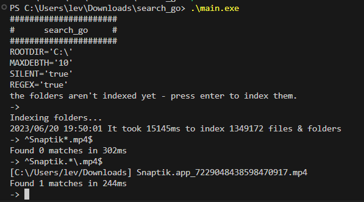

# search_go



## Build

```bash
go build main.go
```

## Default Config

| env      | default | accepts |
| -------- | ------- | ------- |
| ROOTDIR  | C:\     | string  |
| MAXDEBTH | 10      | int     |
| SILENT   | 1       | bool    |
| REGEX    | 1       | bool    |

## Run With Custom Config

In Powershell

```shell
$env:MAXDEBTH=10
$env:SILENT=0
$env:REGEX=1
$env:ROOTDIR='C:\'
.\main.exe
```

In Bash

```bash
MAXDEBTH=10 SILENT=0 REGEX=1 ROOTDIR='C:\' ./main
```

## Example Search Term

Listing all .mp4 files using regex

```
^*.mp4$
```

## Example Functions

### OPEN
This example will open `1080p.mp4` inside the file explorer
```shell
-> ^*.mp4$
[1] HolidayJazz.mp4
[2] 1080p.mp4
[3] 1080p3min.mp4
[4] 1080p60.mp4
[5] 360p.mp4
[6] 480p.mp4
[7] 720p.mp4
Found 7 matches in 12ms
-> --open 2
Opening: C:\tmp\
->
```

### COPY
This example will copy `1080p.mp4` into the folder `beans`
```shell
-> ^*.mp4$
[1] HolidayJazz.mp4
[2] 1080p.mp4
[3] 1080p3min.mp4
[4] 1080p60.mp4
[5] 360p.mp4
[6] 480p.mp4
[7] 720p.mp4
Found 7 matches in 12ms
-> --copy 2 ./beans
->
```

### HELP
This example will output all available commands
```shell
-> --help
#########################
# search_go | help page #
#########################

        --open [number]         # requires a number
        --open 69               # opens the 69th file from the matched files & folders in the explorer

        --limit [number]        # requires a number
        --limit 100             # list only the first 100 matches (set to 0 if you want no limit)

        --copy [number|*]       # requires a number or *
        --copy 100 ./destfolder # copies the 100th file into the destfolder
        --copy * ./destfolder   # copies the all matched files into the destfolder

->
```